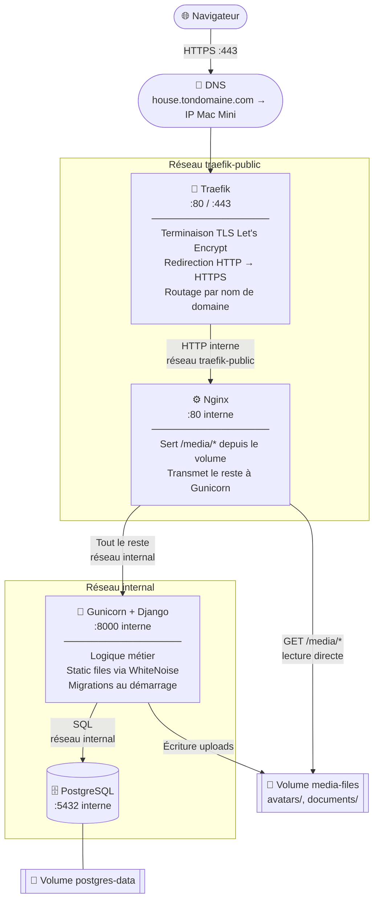

# Déploiement — House App

## Table des matières

1. [Leçon réseau — les bases](#1-leçon-réseau--les-bases)
2. [Architecture](#2-architecture)
3. [Fichiers créés](#3-fichiers-créés)
4. [Prérequis](#4-prérequis)
5. [Installation pas à pas](#5-installation-pas-à-pas)
6. [Mises à jour](#6-mises-à-jour)
7. [Commandes utiles](#7-commandes-utiles)
8. [Backups](#8-backups)
9. [Recommandations](#9-recommandations)
10. [Dépannage](#10-dépannage)

---

## 1. Leçon réseau — les bases

> Cette section explique les concepts réseau utilisés dans ce déploiement. En tant que dev full-stack habitué au code plutôt qu'à l'infra, ces notions reviennent à chaque projet — autant les avoir quelque part.

### 1.1 Comment une requête arrive jusqu'à ton app

Quand tu tapes `https://house.tondomaine.com` dans un navigateur, voici ce qui se passe dans l'ordre :

```
1. Navigateur        → "C'est quoi l'IP de house.tondomaine.com ?"
2. DNS               → "C'est 192.168.1.42" (l'IP de ton Mac Mini)
3. Navigateur        → envoie la requête à 192.168.1.42:443
4. Traefik           → reçoit sur le port 443, déchiffre le TLS
5. Nginx             → reçoit la requête en HTTP simple (réseau interne)
6. Django/Gunicorn   → traite la requête, renvoie une réponse
7. (chemin inverse)  → la réponse remonte jusqu'au navigateur
```

Chaque maillon fait une chose précise et passe la main au suivant.

---

### 1.2 DNS — faire pointer un domaine vers ton serveur

Le **DNS** (Domain Name System) est l'annuaire d'internet : il traduit un nom de domaine en adresse IP.

Pour que `house.tondomaine.com` arrive sur ton Mac Mini, tu dois créer un **enregistrement A** chez ton registrar (où tu as acheté le domaine) :

```
Type : A
Nom  : house          (ou @ pour le domaine racine)
Valeur : <IP publique de ton Mac Mini>
TTL  : 3600
```

> **Trouver l'IP publique de ton Mac Mini :**
> ```bash
> curl ifconfig.me
> ```

> **Attention — IP fixe ou dynamique ?**
> La plupart des connexions résidentielles ont une IP publique qui peut changer. Si c'est ton cas, soit tu souscris à une IP fixe chez ton FAI, soit tu utilises un service de **DNS dynamique** (DynDNS, Cloudflare, etc.) qui met à jour l'enregistrement automatiquement.

---

### 1.3 Ports — les "portes" du serveur

Un serveur a 65 535 ports. Chaque service écoute sur un port précis. Les deux qui nous intéressent :

| Port | Protocole | Rôle |
|------|-----------|------|
| 80   | HTTP      | Web non chiffré — Traefik le redirige vers 443 |
| 443  | HTTPS     | Web chiffré (TLS) — toutes les vraies requêtes passent par là |

Les autres ports (8000 pour Gunicorn, 5432 pour PostgreSQL) ne sont **jamais exposés** à internet dans notre config — ils ne sont accessibles qu'entre les containers Docker sur le réseau interne.

> **Sur ton routeur/box**, il faut que les ports 80 et 443 soient **redirigés** vers l'IP locale du Mac Mini. C'est la **redirection de port** (port forwarding). Sans ça, les requêtes venant d'internet n'atteignent jamais le Mac Mini.

---

### 1.4 TLS / HTTPS — chiffrer les communications

**HTTP** envoie tout en clair sur le réseau. **HTTPS** = HTTP + chiffrement TLS.

Pour chiffrer, il faut un **certificat TLS** délivré par une autorité de certification. **Let's Encrypt** est une autorité gratuite et automatique. Traefik s'en occupe tout seul :

1. Let's Encrypt demande à Traefik de prouver qu'il contrôle le domaine
2. Traefik répond au défi (TLS challenge) sur le port 443
3. Let's Encrypt délivre le certificat (valable 90 jours)
4. Traefik renouvelle automatiquement avant expiration

Tu n'as rien à faire — c'est entièrement automatique dès que le DNS pointe vers ton Mac Mini.

---

### 1.5 Reverse proxy — le rôle de Traefik et Nginx

Un **proxy** est un intermédiaire entre un client et un serveur. Un **reverse proxy** est un intermédiaire côté serveur : il reçoit les requêtes des clients et les distribue vers les bons services.

**Traefik** est un reverse proxy *orienté routage réseau* :
- Il regarde le nom de domaine de la requête (`house.tondomaine.com` vs `traefik.tondomaine.com`)
- Il consulte les labels Docker pour savoir vers quel container router
- Il gère le TLS et la redirection HTTP → HTTPS
- Il **ne lit jamais des fichiers** — il ne fait que router

**Nginx** est un reverse proxy *orienté contenu* :
- Il peut lire des fichiers sur le disque et les servir directement
- Il peut transmettre des requêtes à une autre application (Gunicorn)
- Il ne gère pas le TLS dans notre config — Traefik s'en charge en amont

```
Traefik  =  aiguilleur de train   → "ce train va sur quelle voie ?"
Nginx    =  chef de gare          → "fichier statique ou appli Django ?"
Django   =  le train lui-même     → traite la logique métier
```

---

### 1.6 Réseaux Docker — l'isolation des containers

Par défaut, les containers Docker sont isolés. Pour qu'ils communiquent, ils doivent être sur le même **réseau Docker**.

Dans notre stack, on a deux réseaux :

**`traefik-public`** (externe, partagé avec Traefik)
- Traefik + Nginx y sont connectés
- C'est la seule "porte vers internet"
- Gunicorn et PostgreSQL n'y sont **pas** → ils ne sont jamais accessibles depuis l'extérieur

**`internal`** (privé, créé par notre docker-compose)
- Nginx + Gunicorn + PostgreSQL y sont connectés
- Nginx peut parler à Gunicorn via `http://web:8000`
- Gunicorn peut parler à PostgreSQL via `db:5432`
- Ces noms (`web`, `db`) sont les noms des services dans `docker-compose.prod.yml` — Docker fait la résolution DNS automatiquement

```
Internet ──► traefik-public ──► Nginx
                                  │
                               internal
                                  ├──► Gunicorn (web:8000)
                                  └──► PostgreSQL (db:5432)
```

PostgreSQL n'est **jamais exposé à internet** — il n'est accessible que depuis les containers du réseau `internal`. C'est l'isolation par défaut que Docker permet d'avoir facilement.

---

### 1.7 Volumes Docker — persister les données

Un container Docker est **éphémère** : si tu le supprimes et le recrées, tout ce qu'il contenait disparaît. Pour persister des données, on utilise des **volumes**.

Dans notre stack :

| Volume | Monté dans | Contenu |
|--------|-----------|---------|
| `postgres-data` | `/var/lib/postgresql/data` dans `db` | Toute la base de données |
| `media-files` | `/app/media` dans `web` et `nginx` | Avatars et documents uploadés |

Les volumes survivent aux suppressions/recréations de containers. C'est pourquoi `docker compose down` ne supprime **pas** les données — il faut explicitement `docker compose down -v` pour ça (à ne faire qu'en cas de reset complet voulu).

---

## 2. Architecture



**Réseaux Docker :**
- `traefik-public` (externe, partagé avec Traefik) — Nginx uniquement
- `internal` (privé) — Nginx + Gunicorn + PostgreSQL

**Volumes Docker persistants :**
- `postgres-data` — données de la base PostgreSQL
- `media-files` — uploads utilisateurs (avatars, documents)

---

## 3. Fichiers créés

| Fichier | Rôle |
|---|---|
| `Dockerfile` | Build multi-stage : Node (React) → Python (Django/Gunicorn) |
| `docker-entrypoint.sh` | Migrations + collectstatic + démarrage Gunicorn |
| `docker-compose.prod.yml` | Stack complète : db + web + nginx |
| `nginx/default.conf` | Config Nginx : media files + proxy vers Gunicorn |
| `.env.production.example` | Template des variables d'environnement |
| `.dockerignore` | Exclut .venv, node_modules, secrets, etc. du build |

### Dockerfile — build multi-stage

Le build se fait en deux étapes pour ne pas embarquer Node.js dans l'image finale :

1. **Stage `frontend` (node:22-alpine)** — installe les dépendances npm et compile le React (`npm run build`). L'output va dans `static/react/`.
2. **Stage final (python:3.12-slim)** — installe les dépendances Python, copie le code, copie les assets React compilés depuis le stage 1, et lance `docker-entrypoint.sh`.

### docker-entrypoint.sh

À chaque démarrage du container, dans l'ordre :
1. `python manage.py migrate --noinput` — applique les nouvelles migrations
2. `python manage.py collectstatic --noinput` — copie les fichiers statiques dans `staticfiles/` pour WhiteNoise
3. `gunicorn config.wsgi:application` — démarre le serveur (4 workers, timeout 60s)

### Pourquoi Nginx en plus de Gunicorn ?

Django ne sert les fichiers `/media/` (uploads utilisateurs) qu'en mode `DEBUG=True`. En production, il faut un serveur web dédié. WhiteNoise ne gère que les fichiers statiques (collectstatic), pas les uploads dynamiques. Nginx est configuré pour :
- Servir `/media/` directement depuis le volume `media-files` (avatars, documents)
- Proxifier tout le reste vers Gunicorn en passant le header `X-Forwarded-Proto` (nécessaire pour que Django reconnaisse les requêtes comme HTTPS derrière Traefik)

---

## 4. Prérequis

### Sur le Mac Mini

- [ ] Docker Desktop (ou Docker Engine) installé
- [ ] Traefik déjà en cours d'exécution avec le réseau `traefik-public`
- [ ] Un domaine DNS pointant vers l'IP du Mac Mini (ex: `house.tondomaine.com`)
- [ ] Git installé
- [ ] Accès SSH configuré

### Vérifier que Traefik tourne

```bash
docker ps | grep traefik
# doit afficher un container en état "Up"
```

### Vérifier que le réseau traefik-public existe

```bash
docker network ls | grep traefik-public
# doit afficher la ligne
```

---

## 5. Installation pas à pas

### Étape 1 — Pousser le code (depuis ta machine de dev)

```bash
git add Dockerfile docker-entrypoint.sh docker-compose.prod.yml \
        nginx/default.conf .env.production.example .dockerignore
git commit -m "feat: add Docker production deployment config"
git push
```

### Étape 2 — Se connecter au Mac Mini

```bash
ssh ton-user@mac-mini
```

### Étape 3 — Cloner le repo

```bash
git clone git@github.com:ton-user/house.git ~/Developer/house
cd ~/Developer/house
```

### Étape 4 — Créer le fichier `.env`

```bash
cp .env.production.example .env
nano .env   # ou vim, selon ta préférence
```

Remplir chaque valeur :

```env
# Remplacer house.tondomaine.com par ton vrai domaine
DOMAIN=house.tondomaine.com
ALLOWED_HOSTS=house.tondomaine.com
CSRF_TRUSTED_ORIGINS=https://house.tondomaine.com
CORS_ALLOWED_ORIGINS=https://house.tondomaine.com

# Générer une clé secrète forte :
# openssl rand -base64 50
SECRET_KEY=<résultat de openssl rand -base64 50>

# Choisir un mot de passe PostgreSQL fort
POSTGRES_PASSWORD=un-mot-de-passe-fort-ici
DATABASE_URL=postgres://house_user:un-mot-de-passe-fort-ici@db:5432/house

# Ces valeurs sont correctes telles quelles
DJANGO_SETTINGS_MODULE=config.settings.production
DEBUG=False
SECURE_SSL_REDIRECT=True
USE_X_FORWARDED_PROTO=True
SESSION_COOKIE_SECURE=True
CSRF_COOKIE_SECURE=True
```

> **Important :** `DATABASE_URL` utilise `db` comme hostname — c'est le nom du service Docker défini dans `docker-compose.prod.yml`. Ne pas mettre `localhost`.

### Étape 5 — Build et démarrage

```bash
docker compose -f docker-compose.prod.yml up -d --build
```

Le premier build prend environ 3 à 5 minutes (compilation React + installation des dépendances Python).

### Étape 6 — Vérifier que tout tourne

```bash
docker compose -f docker-compose.prod.yml ps
```

Les trois services doivent être en état `Up` :

```
NAME          IMAGE          STATUS
house-db-1    postgres:16    Up
house-web-1   house:latest   Up
house-nginx-1 nginx:alpine   Up
```

Consulter les logs en cas de problème :

```bash
docker compose -f docker-compose.prod.yml logs -f
# ou uniquement un service :
docker compose -f docker-compose.prod.yml logs -f web
```

### Étape 7 — Créer le compte administrateur

```bash
docker compose -f docker-compose.prod.yml exec web python manage.py createsuperuser
```

### Étape 8 — Vérifier dans le navigateur

Ouvrir `https://house.tondomaine.com` — Traefik doit avoir obtenu le certificat Let's Encrypt automatiquement (peut prendre 30 secondes au premier accès).

---

## 6. Mises à jour

Pour déployer une nouvelle version de l'app :

```bash
cd ~/apps/house
git pull
docker compose -f docker-compose.prod.yml up -d --build
```

Les migrations sont appliquées automatiquement au démarrage du nouveau container. L'ancien container reste actif pendant le build, ce qui minimise l'indisponibilité.

---

## 7. Commandes utiles

```bash
# Logs en temps réel
docker compose -f docker-compose.prod.yml logs -f

# Shell Django (pour déboguer, créer des objets, etc.)
docker compose -f docker-compose.prod.yml exec web python manage.py shell

# Shell PostgreSQL
docker compose -f docker-compose.prod.yml exec db psql -U house_user house

# Redémarrer un service sans rebuild
docker compose -f docker-compose.prod.yml restart web

# Arrêter toute la stack (sans supprimer les volumes)
docker compose -f docker-compose.prod.yml down

# Arrêter ET supprimer les volumes (⚠️ supprime la DB et les médias)
docker compose -f docker-compose.prod.yml down -v
```

---

## 8. Backups

### Backup de la base de données

Les données PostgreSQL sont dans le volume Docker `house_postgres-data` (Docker préfixe avec le nom du projet). Il faut les exporter régulièrement.

**Backup manuel :**

```bash
docker compose -f docker-compose.prod.yml exec db \
  pg_dump -U house_user house | gzip > ~/backups/house_$(date +%Y%m%d_%H%M).sql.gz
```

**Backup automatique via crontab :**

```bash
# Créer le dossier de backups
mkdir -p ~/backups

# Éditer la crontab
crontab -e
```

Ajouter cette ligne (backup quotidien à 3h du matin, conservation 30 jours) :

```cron
0 3 * * * docker exec house-db-1 pg_dump -U house_user house | gzip > ~/backups/house_$(date +\%Y\%m\%d).sql.gz && find ~/backups -name "house_*.sql.gz" -mtime +30 -delete
```

> **Note :** Le nom `house-db-1` vient de Docker Compose. Vérifier avec `docker ps` si le nom diffère.

**Restaurer un backup :**

```bash
gunzip -c ~/backups/house_20250101.sql.gz | \
  docker compose -f docker-compose.prod.yml exec -T db \
  psql -U house_user house
```

### Backup des media files

Les fichiers uploadés (avatars, documents) sont dans le volume `media-files`. Pour les sauvegarder :

```bash
docker run --rm \
  -v house_media-files:/data \
  -v ~/backups:/backup \
  alpine tar czf /backup/media_$(date +%Y%m%d).tar.gz -C /data .
```

---

## 9. Recommandations

### Priorité haute

**Backups automatiques**
Mettre en place la crontab décrite ci-dessus dès le premier jour. Une base de données sans backup n'est pas une base de données de production.

**Vérifier la taille des uploads**
Nginx est configuré avec `client_max_body_size 50M`. Si l'app est amenée à recevoir des fichiers plus lourds, augmenter cette valeur dans `nginx/default.conf` et redémarrer Nginx (`docker compose -f docker-compose.prod.yml restart nginx`).

### Priorité moyenne

**Ajuster le nombre de workers Gunicorn**
Actuellement fixé à 4. La formule recommandée est `2 × CPU + 1`. Sur un Mac Mini M2 (8 cœurs) : 17 workers est le maximum théorique, mais 4–6 est raisonnable pour une app perso. Modifier dans `docker-entrypoint.sh`.

**Fuseau horaire**
`TIME_ZONE = "UTC"` dans `base.py`. Si tu veux que les horodatages dans l'admin Django correspondent à ton heure locale, changer pour `"Europe/Paris"` (ou ta timezone). Les données en base restent en UTC, seul l'affichage change.

### Priorité basse

**Health check sur le service `web`**
Le service `db` a déjà un health check (pg_isready). Le service `web` n'en a pas encore. Pour que Docker sache si Gunicorn est réellement opérationnel :

```yaml
# Dans le service web de docker-compose.prod.yml :
healthcheck:
  test: ["CMD", "python", "-c", "import urllib.request; urllib.request.urlopen('http://localhost:8000/api/health/')"]
  interval: 30s
  timeout: 10s
  retries: 3
```
Nécessite d'ajouter un endpoint `/api/health/` dans Django.

**Logs persistants**
Les logs Gunicorn et Nginx vont dans stdout/stderr et sont gérés par Docker. Pour les conserver durablement, soit utiliser `docker logs` avec rotation configurée dans `/etc/docker/daemon.json` sur le Mac Mini :

```json
{
  "log-driver": "json-file",
  "log-opts": {
    "max-size": "10m",
    "max-file": "5"
  }
}
```

---

## 10. Dépannage

### Le container `web` redémarre en boucle

```bash
docker compose -f docker-compose.prod.yml logs web
```

Causes fréquentes :
- Variable manquante dans `.env` (ex: `SECRET_KEY` non définie)
- `DATABASE_URL` incorrect (mauvais mot de passe ou hostname)
- Permissions sur le volume `media-files`

### Erreur 502 Bad Gateway dans le navigateur

Nginx ne joind pas Gunicorn. Vérifier que le service `web` tourne :

```bash
docker compose -f docker-compose.prod.yml ps web
docker compose -f docker-compose.prod.yml logs web
```

### Le certificat Let's Encrypt ne s'obtient pas

- Vérifier que le DNS pointe bien vers le Mac Mini : `dig house.tondomaine.com`
- Vérifier que le port 443 est ouvert sur le routeur/firewall du Mac Mini
- Consulter les logs Traefik : `cd ~/traefik-public && docker compose -f docker-compose.traefik.yml logs traefik`

### Les fichiers media (avatars, documents) ne s'affichent pas

Vérifier que Nginx a accès au volume :

```bash
docker compose -f docker-compose.prod.yml exec nginx ls /app/media/
```

Si le dossier est vide, les uploads se font peut-être dans le mauvais container. Vérifier que `media-files` est bien monté sur `web` ET `nginx`.

### Rollback en cas de problème

Si une mise à jour casse l'app :

```bash
# Revenir au commit précédent
git revert HEAD
git push

# Sur le Mac Mini
git pull
docker compose -f docker-compose.prod.yml up -d --build
```
