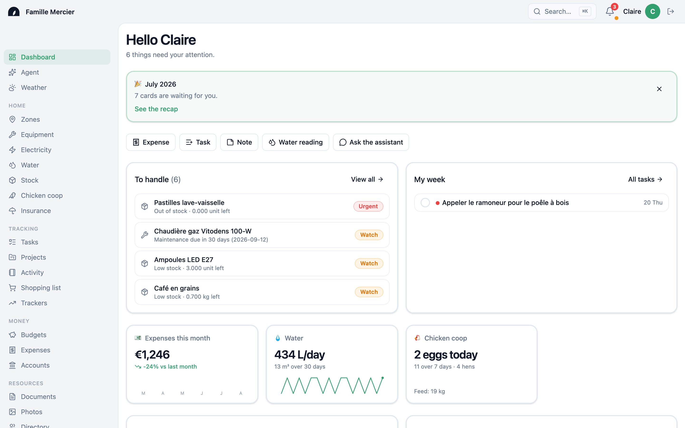
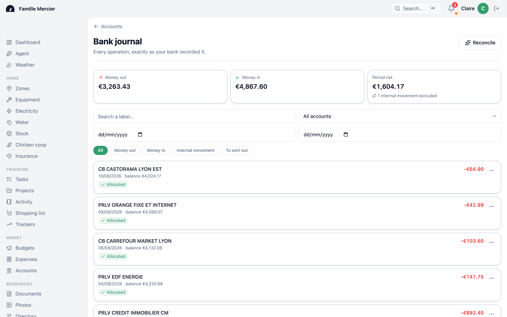
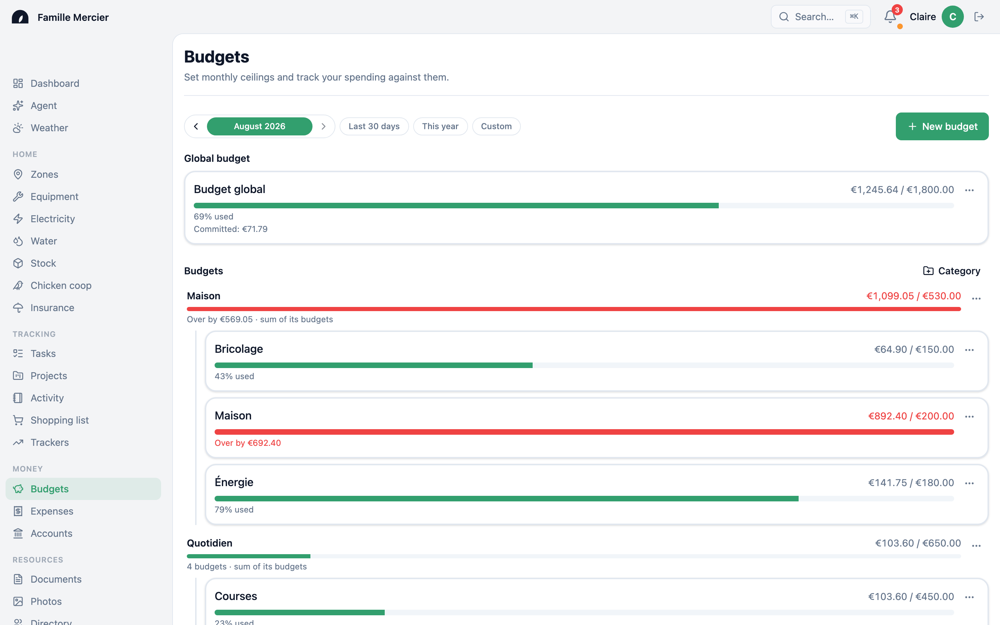
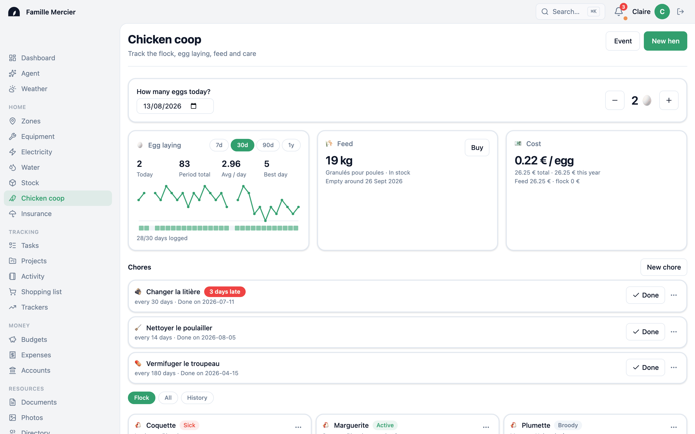
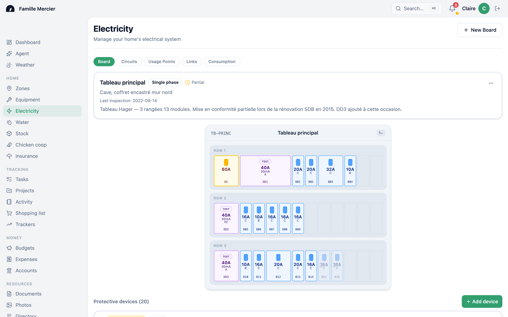
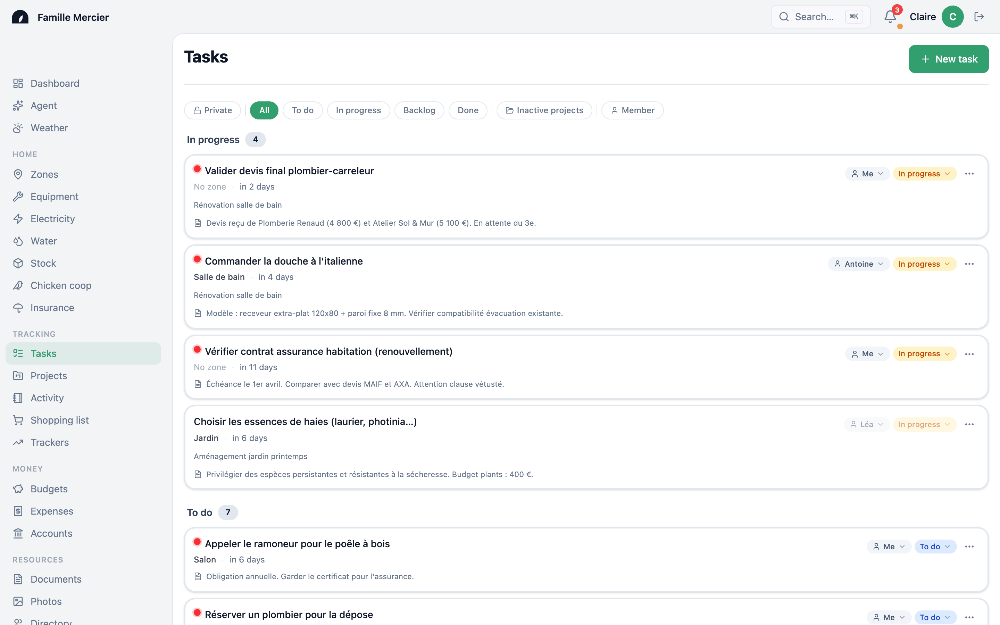

<div align="center">


# Maisonnée

**Tout ce qu'un foyer fait vivre.**
Dedans comme dehors : les comptes, les chantiers, les compteurs, le potager, les bêtes.

[Installer](#linstaller-en-trois-lignes) · [Ce que ça fait](#ce-que-ça-fait) ·
[Ce que ça ne fait pas](#ce-que-ça-ne-fait-pas) ·
[Doc auto-hébergement](docs/self-hosting/README.md) · [English](README.md)

</div>



> Les captures montrent l'interface en anglais — c'est la langue du README que lit
> un inconnu. L'interface parle aussi français, allemand et espagnol.

---

## L'idée

La plupart des logiciels de foyer vous font choisir un coin. Une appli de budget
pour l'argent. Une appli de tâches pour les corvées. Un tableur pour les relevés
de compteur. Une note quelque part pour la dernière révision de la chaudière.
Chacune fait bien son travail, aucune ne connaît les autres — et rien ne tombe
jamais juste.

Maisonnée tient un seul registre pour tout le foyer. La rénovation de la salle de
bain est **en même temps** un chantier, une pile de tickets, des photos avant et
après, et une ligne dans l'enveloppe « Maison ». Le granulé des poules est du
stock, une corvée récurrente, et 0,22 € par œuf. Le tableau électrique de la cave
est un schéma qu'on arrive à lire quand quelque chose disjoncte.

La règle sur laquelle tout le versant argent est bâti :

> **Chaque euro est soit rangé, soit signalé.** Rien ne reste dans un entre-deux
> silencieux.

On importe un relevé et chaque ligne doit atterrir quelque part : ventilée entre
plusieurs budgets, rattachée à un chantier, marquée comme virement interne, ou
listée comme restant à ranger. Ce que l'app ne sait pas expliquer, elle le dit —
au lieu de le noyer discrètement dans une moyenne.

## L'installer en trois lignes

```bash
curl -O https://raw.githubusercontent.com/jammindev/house/main/docker-compose.yml
docker compose up
open http://localhost:8000
```

Pas de Python, pas de Node, pas de `git clone`, aucune clé d'API à souscrire. Le
premier démarrage tire l'image, crée la base, applique le schéma et crée le
premier compte — le mot de passe s'affiche une seule fois dans la sortie, donc on
le copie.

Tourne en `amd64` et `arm64` : un Raspberry Pi 4/5, un boîtier N100 ou un Synology
suffisent. Environ 2 Go de RAM et 5 Go de disque pour commencer.

Guide complet : [docs/self-hosting/install.md](docs/self-hosting/install.md) —
avec la mise derrière Caddy ou Traefik, les sauvegardes et les mises à jour.

## Ce que ça fait

### L'argent, jusqu'à la ligne



On importe un relevé CSV et on le rapproche. Une même ligne bancaire peut se
ventiler entre plusieurs budgets **et** se rattacher à un chantier : 150 € chez
Leroy Merlin, c'est 90 € de « la salle de bain » et 60 € d'entretien courant. Un
remboursement recrédite l'enveloppe. Un virement entre vos propres comptes cesse
de compter comme une dépense. Et un onglet **Contrôle** liste, avec un motif,
tout ce que l'app ne sait pas justifier : un solde d'ouverture manquant, une
période jamais importée, un relevé dont les soldes imprimés ne tombent pas juste.

### Des budgets qui avouent ce qu'ils ignorent



Des plafonds mensuels, des catégories imbriquées, et le plafond est
**facultatif** : « Cadeaux » peut être une catégorie suivie sans limite, parce
qu'inventer un montant pour obtenir une catégorie rend toutes les autres barres
illisibles. Le dépensé s'affiche en deux chiffres : la part qu'une ligne de
relevé prouve, et celle qui attend encore la sienne.

### Le dehors n'est pas un module en plus



Poules, eau, électricité, stock, potager — même registre que l'argent, et c'est
précisément pour ça que le poulailler sait dire ce que coûte un œuf. La ponte,
les réserves de granulé, les corvées récurrentes, et chaque poule avec son
histoire.



Le tableau, dessiné tel qu'il est. Les circuits, les appareils de protection, ce
qui alimente quoi — ce qu'on veut avoir sous les yeux quand ça disjoncte et qu'on
est dans la cave avec une lampe torche.

### Et les choses ordinaires



Tâches et corvées récurrentes, zones et équipements, documents avec recherche
plein texte dans leur contenu, contrats d'assurance, liste de courses, photos.

### Optionnel, si vous apportez une clé

Un assistant qui répond sur *votre* foyer et sait y créer des choses, la recherche
sémantique, un récap mensuel écrit en langage courant, les notifications push, un
bot Telegram. Chacun demande une clé ou un service que vous fournissez. **Aucun
n'est requis**, et l'interface dit clairement qu'une capacité est indisponible au
lieu de proposer un bouton qui échoue.

## Ce que ça ne fait pas

Écrit ici pour que vous le sachiez avant d'installer, pas après :

- **Pas d'agrégation bancaire.** Vous exportez un CSV depuis votre banque et vous
  l'importez. Ni Plaid, ni Bridge, ni scraping de votre compte.
- **Pas de version hébergée.** Vous la faites tourner, ou pas. Il n'y a pas de
  compte à créer sur le serveur de quelqu'un d'autre.
- **Pas d'appli mobile native.** C'est une PWA : installable, consultable hors
  ligne, et elle reçoit les photos partagées depuis Android et iOS.
- **Pas de télémétrie.** Rien n'appelle la maison. Jamais.
- **Pas de multi-devise.** Les montants sont en euros.
- **L'IA est optionnelle et c'est la vôtre.** Pas de clé, pas d'assistant — et le
  reste de l'app est intact.
- **Ce n'est pas un produit d'équipe.** Ça modélise un foyer : quelques personnes
  qui se font confiance et partagent un toit.

## État du projet

**v0.1.0.** Construit pour un foyer réel, et utilisé quotidiennement par lui
depuis 2025. Il n'a eu qu'un seul utilisateur pendant l'essentiel de sa vie, ce
qui se voit dans les deux sens : ce que ce foyer utilise est poli par l'usage, ce
qu'il n'utilise pas est plus jeune qu'il n'en a l'air.

Pour être franc sur sa forme :

- L'interface parle **anglais, français, allemand et espagnol**.
- La documentation interne et une partie des commentaires sont **en français**.
  C'est un choix assumé et documenté, pas de la négligence — voir
  [CONTRIBUTING.md](CONTRIBUTING.md).
- La sauvegarde **et la restauration** sont scriptées et rejouées en CI à chaque
  release, parce qu'une sauvegarde que personne n'a restaurée n'est pas une
  sauvegarde.
- Une migration destructive se livre en deux fois : une mise à jour ne demande
  jamais que vous soyez devant l'écran.

Si vous l'installez, la chose la plus utile que vous puissiez faire est de dire à
l'auteur ce qui a cassé. Ça vaut plus, en ce moment, qu'une pull request.

## Documentation

| | |
|---|---|
| [Auto-hébergement](docs/self-hosting/README.md) | Installation, sauvegarde et restauration, mises à jour, dépannage |
| [Fournisseurs d'IA](docs/self-hosting/ai-providers.md) | Quelle clé débloque quoi, et ce qui se passe sans |
| [Contribuer](CONTRIBUTING.md) | Comment aider, et dans quelle langue le projet est écrit |
| [Sécurité](SECURITY.md) | Signaler une faille, en privé |
| [Hub de la doc](docs/README.md) | Parcours, fiches concept, modules |

## Licence

[AGPL-3.0-only](LICENSE). Faites-la tourner, modifiez-la, partagez-la. Si vous
hébergez une version modifiée *pour d'autres*, publiez vos modifications —
l'héberger pour votre propre famille n'est pas « pour d'autres », c'est l'usage
normal de ce logiciel.

Le **nom et le signe ne sont pas couverts par la licence** ; un fork redistribué
porte son propre nom. Les détails, sans jargon juridique :
[docs/assets/brand/README.md](docs/assets/brand/README.md).
